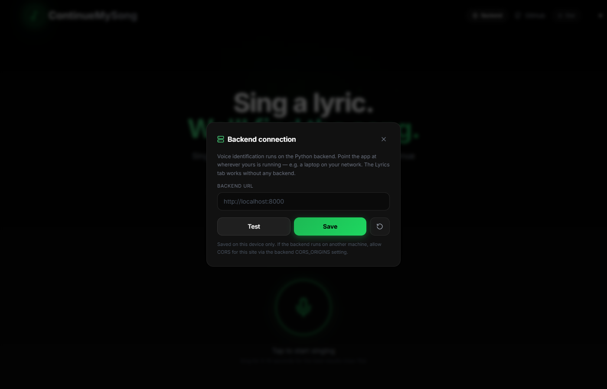

# [Music] LyricSpot

**Sing a lyric. We'll find the song. Keep listening right where you left off.**

[](https://shashwat1729.github.io/lyricspot/)
[](LICENSE)

---

## What is this?

Ever had a song stuck in your head but only remember one line? LyricSpot listens to you sing (or reads what you type), identifies the song using local AI, finds the exact second your lyric appears, and opens Spotify right at that timestamp.

**No cloud, no tracking, no paid APIs.** With a backend running, everything stays on your machine. On GitHub Pages the Lyrics tab works directly in your browser (Genius lyric discovery + LRCLIB + iTunes) — still no keys, no tracking.

## Features

- **Voice Input** - Sing into your mic (3s min, 5-10s recommended, 15s max) — uses Whisper when a backend is connected, falls back to in-browser speech recognition on Pages
- **Text Input** - Type whatever lyrics you remember — live lyric search with browser fallback
- **Local AI** - OpenAI Whisper when a backend is running; browser Speech API as fallback on Pages
- **Multi-Source Search** - YouTube + Genius + iTunes + Musixmatch + Deezer + MusicBrainz (backend); Genius + Musixmatch + LRCLIB + iTunes (browser, keys optional)
- **Popularity-Aware Ranking** - Famous originals outrank obscure covers with identical lyrics
- **Precise Timestamps** - Finds the exact second your lyric appears (including repeated choruses)
- **Spotify Deep Link** - One click opens Spotify at the right timestamp
- **Multilingual input** - English, Hindi, Korean, Spanish, French, Portuguese, Japanese; accuracy is highest for English and varies by language and singing style

## Quick Start

### Prerequisites
- Node.js 18+, Python 3.9+, ffmpeg

### One command (Linux/WSL)
```bash
chmod +x start.sh && ./start.sh
```

### Manual

**Backend:**
```bash
cd backend
python -m venv venv && source venv/bin/activate
pip install -r requirements.txt
uvicorn main:app --host 0.0.0.0 --port 8000
```

**Frontend:**
```bash
cd frontend
npm install && npm run dev
```

Open **http://localhost:3000**

## Environment Variables

Copy backend/.env.example to backend/.env:

| Variable | Required | Default | Description |
|----------|----------|---------|-------------|
| SPOTIFY_CLIENT_ID | Recommended | - | Spotify API client ID |
| SPOTIFY_CLIENT_SECRET | Recommended | - | Spotify API client secret |
| WHISPER_MODEL | No | base | Model size: tiny, base, small, medium |
| CORS_ORIGINS | No | - | Comma-separated allowed origins |
| TRANSCRIPTION_MIN_CONFIDENCE | No | 0.35 | Below this, the backend asks for a longer clip instead of searching |
| CONFIDENCE_HIGH_THRESHOLD | No | 70 | Absolute score needed for a "high" confidence result |
| CONFIDENCE_HIGH_MARGIN | No | 10 | Top-1/top-2 gap needed for a "high" confidence result |

## How the two deployments relate

**Local (full power):** Backend does Whisper + parallel search + lyric verification. Most accurate, private, supports all languages.

**GitHub Pages (zero setup):** Static build at [shashwat1729.github.io/lyricspot/](https://shashwat1729.github.io/lyricspot/) — no server needed.

- **Lyrics tab** searches Genius (lyric discovery) + LRCLIB (lyrics) + iTunes (metadata/artwork) directly from your browser, finds real songs with timestamps and artwork. No keys needed.
- **Voice tab** tries the backend first; if unreachable, falls back to in-browser speech recognition piped into the same search.

## API keys (all free, all optional)

The static site works with zero keys. To improve it, open **API keys** (top right) and paste any of these — they are stored only in your browser, never uploaded:

| Key | What it unlocks | Where to get it (free) |
|-----|-----------------|------------------------|
| Musixmatch | Genuine lyrics → song search (same provider the backend uses) | developer.musixmatch.com (free tier: 2000 calls/day) |
| Genius token | Upgrades lyric discovery to the official API | genius.com/api-clients → Generate Access Token |
| Spotify ID + Secret | Popularity ranking (famous originals outrank covers) + artwork | developer.spotify.com/dashboard |

Each row has a **Test** button so you can verify a key before saving. No paid APIs are used anywhere in this project.

If you run your own backend elsewhere, set it under **API keys → Advanced** (top right). That URL is saved on your device and takes precedence. Or host `backend/` once (HuggingFace Spaces / Render / Railway — Dockerfile already handles `PORT`, just set `CORS_ORIGINS=https://shashwat1729.github.io`) and bake it in with `NEXT_PUBLIC_API_URL=https://your-host npm run build`.


## Architecture — how a lyric becomes a ranked result

```
Input (voice or typed)
  → Retrieval (broad, never early-stop)
      Backend: YouTube + Genius (+token) + iTunes + Musixmatch + Deezer + MusicBrainz in parallel, merged by provider agreement
      Browser: Genius lyric discovery (+token via access_token=) + Musixmatch q_lyrics + LRCLIB q + iTunes + lyrics.ovh suggest, deduped, pool ≤40
  → Lyric enrichment
      LRCLIB structured search → lyrics.ovh plain-text fallback; synced LRC parsed, plain split, boilerplate stripped
      Deep resolve when <5 scored: pull lyrics for metadata-only pool and re-score
  → Scoring
      Best line per song via tokenScore (BM25-style, length-normed, containment-gated) + pair stitching; cross-script via Devanagari romanization + relaxed vowels
  → Ranking (deterministic, testable)
      Frontend: 0.65 lyric / 0.25 popularity / 0.10 title with 5 dynamic rules (exact hook, short/long query, flat popularity, lyric-tie cluster); popularity is Spotify when keys exist else iTunes proxy (source-tagged)
      Backend: 0.50 lyric / 0.20 coverage / 0.10 locality / 0.10 title / 0.05 popularity / 0.05 provider agreement + bounded lyric-tie pop nudge + constraint floors/ceilings
      Confidence ≠ rank: #1 can still be "uncertain" when absolute evidence or margin is weak
  → Pagination
      12 distinct songs max (deduped + cover-grouped: version suffixes stripped, lyric-family clustering), Top 5 → Load 3 → Load 3… (5/8/11), stable order, no duplicates, no re-search, honest empty/end states
```

No song, language, or query is hardcoded. Every case in `backend/tests/eval_dataset.json` (31 cases with hard negatives) is a regression harness, not production logic.

## Evaluation

`pytest backend/tests/test_comprehensive_eval.py` measures Top-1/Top-3/Top-5, MRR/Recall@5 on the dataset; `pytest backend/tests/test_ranking.py` asserts lyric-content-first ordering (e.g. Hey Jude lyric vs title trap) remains green. Frontend has a 36-assertion harness (`verify-browsersearch.cjs`) covering romanization, scoring, version stripping, and cover grouping.

## Screenshots

Live capture from the GitHub Pages site — real browser search via LRCLIB + iTunes, zero backend.

| Voice Mode | Lyrics Mode | Lyrics Result |
|:---:|:---:|:---:|
|  |  |  |

<details>
<summary>API keys settings (click to expand)</summary>
<br>



*Key icon top-right — paste free Musixmatch / Genius / Spotify keys and test each one. Lyrics tab works immediately without any key; voice falls back to in-browser speech recognition.*
</details>

## Demo

- **Live site:** [shashwat1729.github.io/lyricspot/](https://shashwat1729.github.io/lyricspot/) — Lyrics tab works with zero setup; voice needs a backend or Chrome's built-in speech recognition.
- **Interactive walkthrough:** [shashwat1729.github.io/lyricspot/demo/](https://shashwat1729.github.io/lyricspot/demo/) — 6-step slideshow generated from the live build.