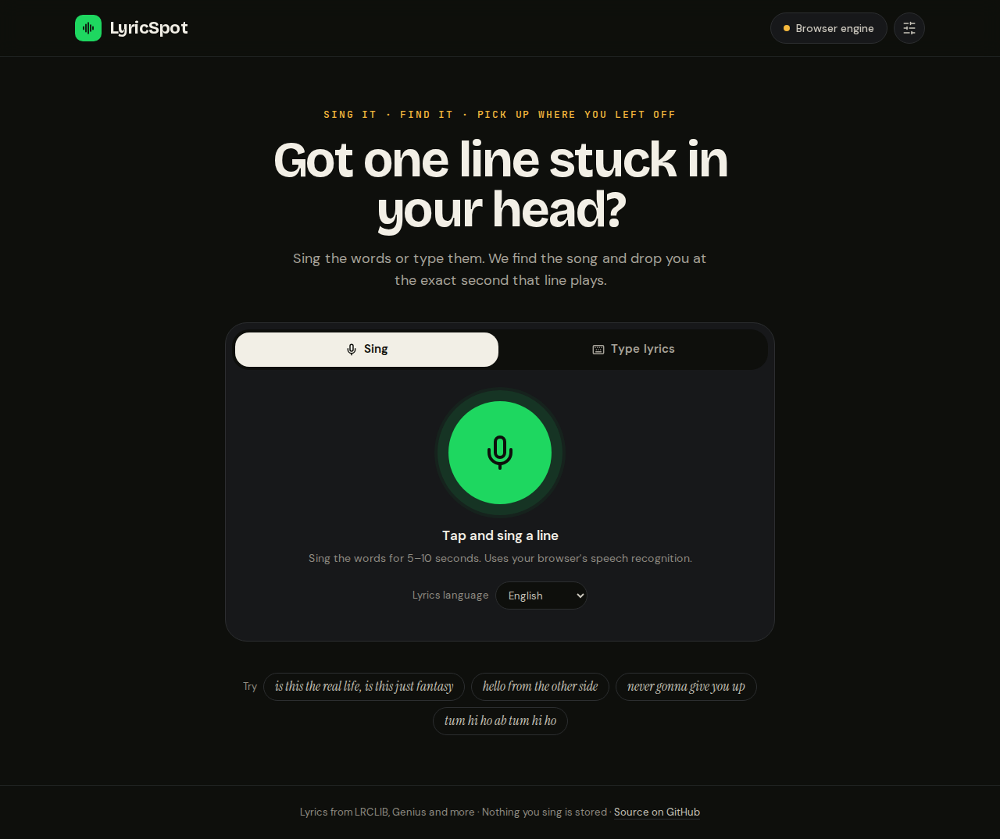
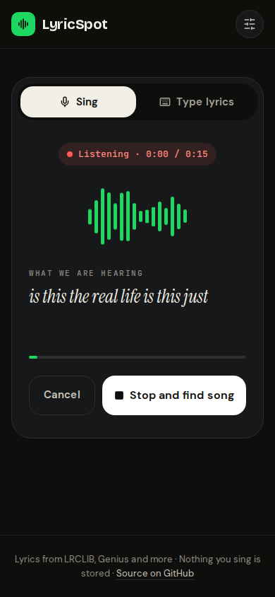

# LyricSpot

**Sing the line stuck in your head. Find the song. Keep listening from that exact second.**

[](https://shashwat1729.github.io/lyricspot/)
[](LICENSE)

| Home | Result | Listening (phone) |
|:---:|:---:|:---:|
|  |  |  |

## What it does

1. **Sing the words or type them.** Voice is transcribed live in your browser, or by Whisper when you run the backend.
2. **We find the song.** Lyric databases are searched in parallel and every candidate is *verified against its real lyrics*, not just its title.
3. **We find the second.** Synced lyrics give the timestamp of your line. The result shows the lines around it, a Spotify player cued to it, and links to Spotify, YouTube and Apple Music.

It works with **zero setup** on the live site. No account, no keys, nothing you sing is stored.

### Humming

Lyric search needs words, and humming has none. So:
- In the browser, a clip with no words gets a clear "sing the words or type them" message, never a wrong search.
- With the backend and free [ACRCloud](https://www.acrcloud.com/) credentials, hummed clips are **matched by melody** (query-by-humming). The backend also falls back to melody matching when a sung clip's words find nothing.

## Two ways to run it

| | Static site (GitHub Pages) | With the backend |
|---|---|---|
| Setup | none | `./start.sh` |
| Voice | Browser speech recognition (Chrome, Edge, Safari) | Whisper (any browser), plus humming with ACRCloud |
| Sources | LRCLIB, Genius, iTunes, lyrics.ovh (Deezer), plus your optional free keys | YouTube, Genius, iTunes, Musixmatch, Deezer, MusicBrainz, LRCLIB |
| Spotify track | iTunes → song.link (keyless) or your Spotify keys | Spotify API (server keys), else resolved in the browser |

The frontend checks `GET /health` on load: if a backend answers, it's used (and its capabilities decide the voice path); if not, or if it fails mid-search, the browser engine takes over and the result says so.

## Quick start

```bash
./start.sh           # full install: text + voice (needs ffmpeg; installs CPU torch + Whisper)
./start.sh --text    # text search only: small install, no torch
```

Then open http://localhost:3000. Backend health: http://localhost:8000/health.

Manual:

```bash
# backend
cd backend && python -m venv venv && source venv/bin/activate
pip install -r requirements-core.txt      # or requirements.txt for voice
cp .env.example .env                      # optional keys
uvicorn main:app --port 8000

# frontend
cd frontend && npm install && npm run dev
```

Docker: `docker compose up --build` (backend with Whisper + frontend on :3000).

## Optional keys

**Browser (live site):** open the sliders icon (top right) → *Search sources*. Keys are stored only in your browser and sent only to their provider. Each has *Save and test*.

| Key | Adds |
|---|---|
| Spotify client ID + secret | Exact Spotify tracks for the player, popularity ranking |
| Genius token | Official lyric search |
| Musixmatch | Lyrics-to-song index |
| Google API key + search engine ID | Web-wide lyric pages (100 free/day) |
| Gemini | Fixes misspelled/romanized lines before searching |

**Backend:** see [`backend/.env.example`](backend/.env.example): Spotify, Musixmatch, Genius, ACRCloud (humming), Whisper model, CORS.

To use your own backend from the live site, enter its URL under *Search sources → Backend URL* and add `https://shashwat1729.github.io` to `CORS_ORIGINS` (it's in the default list).

## Architecture

```
frontend/ (Next.js static export)
  components/App.tsx        state machine: compose → searching → results | error; ?q= deep links + back button
  lib/engine.ts             one search API for the UI; backend first, browser fallback; normalized results
  lib/browserSearch.ts      in-browser engine: retrieval → lyric verification → ranking → cover grouping
  lib/links.ts              exact Spotify track (backend / Spotify keys / iTunes→song.link), YouTube, Apple Music
  lib/speech.ts             live speech recognition + MediaRecorder with level meter
  lib/api.ts                backend client + capability probe

backend/ (FastAPI)
  main.py                   HTTP layer only: validation, rate limits, CORS, capability report
  config.py                 every setting, read once from env
  services/pipeline.py      transcript → candidates → lyric evidence → ranking → response (shared by all endpoints)
  services/song_identifier  multi-provider candidate retrieval
  services/lyrics_fetcher   synced/plain lyrics; timestamp_matcher finds the line
  services/candidate_ranker lyric-content-first scoring + confidence bands
  services/melody_recognizer ACRCloud query-by-humming (optional)
  services/transcriber      Whisper, lazily loaded (the API runs without it)
```

Ranking is lyric-first in both engines: a candidate's score comes from how well your words match its actual lyric lines, then popularity and title act as tie-breakers so famous originals beat karaoke copies. Confidence is shown honestly: a "Close call" or "Low confidence" banner when the top result isn't clearly ahead.

## Tests

```bash
cd backend && pytest tests/                 # 120+ tests: ranking, pipeline, melody, API
cd frontend && npm run test:unit            # scoring harness on the shipped browser engine
cd frontend && npm run build && npm run test:e2e   # Playwright: typed search, live voice, humming, recording upload, backend mode
```

End-to-end tests mock every third-party API, so they're deterministic and run offline. CI runs all of the above on every push and PR.

## Deploying the static site

```bash
cd frontend && npm run build:pages   # builds with base path /lyricspot and copies the export into docs/
```

GitHub Pages serves `docs/` from `main`. `E2E_PAGES=1 npm run test:e2e` runs the end-to-end suite against that exact bundle under `/lyricspot/`.

## Honest limits

- The live site can only use APIs that allow browser (CORS) access. Musixmatch and some search engines need the backend.
- Browser speech recognition is built for speech, not singing: clear, word-by-word singing works best. The backend's Whisper is more robust.
- Spotify's embedded player only plays full tracks for logged-in listeners; others get a 30-second preview.
- Timestamps come from synced lyrics. When only plain lyrics exist, the time is estimated and marked with `~`.

## License

MIT
