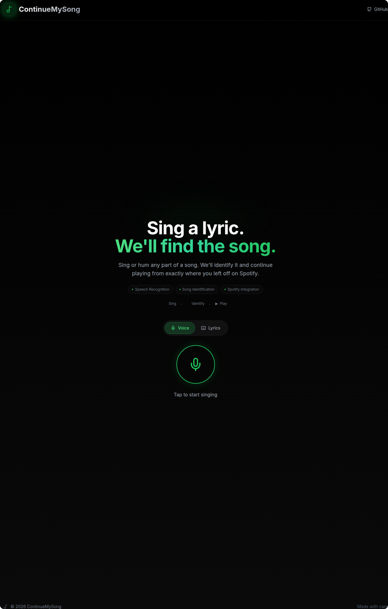
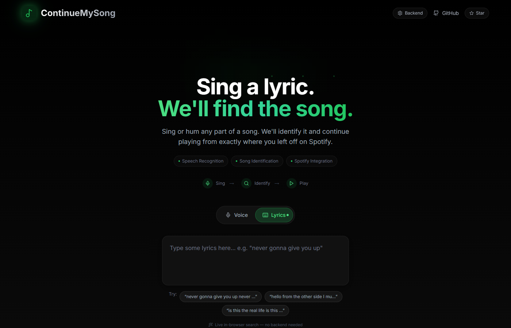
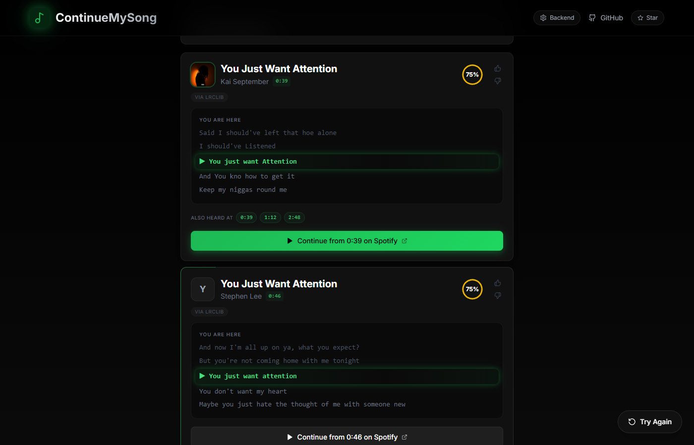

# [Music] LyricSpot

**Sing a lyric. We'll find the song. Keep listening right where you left off.**

[](https://shashwat1729.github.io/lyricspot/)
[](LICENSE)

---

## What is this?

Ever had a song stuck in your head but only remember one line? LyricSpot listens to you sing (or reads what you type), identifies the song using local AI, finds the exact second your lyric appears, and opens Spotify right at that timestamp.

**No cloud, no tracking, no paid APIs.** With a backend running, everything stays on your machine. On GitHub Pages the Lyrics tab works directly in your browser (LRCLIB + iTunes) — still no keys, no tracking.

## Features

- **Voice Input** - Sing into your mic (3s min, 5-10s recommended, 15s max) — uses Whisper when a backend is connected, falls back to in-browser speech recognition on Pages
- **Text Input** - Type whatever lyrics you remember — live lyric search with browser fallback
- **Local AI** - OpenAI Whisper when a backend is running; browser Speech API as fallback on Pages
- **Multi-Source Search** - YouTube + Genius + iTunes + Musixmatch + Deezer + MusicBrainz (backend); LRCLIB + iTunes (browser)
- **Popularity-Aware Ranking** - Famous originals outrank obscure covers with identical lyrics
- **Precise Timestamps** - Finds the exact second your lyric appears (including repeated choruses)
- **Spotify Deep Link** - One click opens Spotify at the right timestamp
- **Multilingual input** - English, Hindi, Korean, Spanish, French, Portuguese, Japanese; accuracy is highest for English and varies by language and singing style

## Quick Start

### Prerequisites
- Node.js 18+, Python 3.9+, ffmpeg

### One command (Linux/WSL)
```bash
chmod +x start.sh && ./start.sh
```

### Manual

**Backend:**
```bash
cd backend
python -m venv venv && source venv/bin/activate
pip install -r requirements.txt
uvicorn main:app --host 0.0.0.0 --port 8000
```

**Frontend:**
```bash
cd frontend
npm install && npm run dev
```

Open **http://localhost:3000**

## Environment Variables

Copy backend/.env.example to backend/.env:

| Variable | Required | Default | Description |
|----------|----------|---------|-------------|
| SPOTIFY_CLIENT_ID | Recommended | - | Spotify API client ID |
| SPOTIFY_CLIENT_SECRET | Recommended | - | Spotify API client secret |
| WHISPER_MODEL | No | base | Model size: tiny, base, small, medium |
| CORS_ORIGINS | No | - | Comma-separated allowed origins |
| TRANSCRIPTION_MIN_CONFIDENCE | No | 0.35 | Below this, the backend asks for a longer clip instead of searching |
| CONFIDENCE_HIGH_THRESHOLD | No | 70 | Absolute score needed for a "high" confidence result |
| CONFIDENCE_HIGH_MARGIN | No | 10 | Top-1/top-2 gap needed for a "high" confidence result |

## How the two deployments relate

**Local (full power):** Backend does Whisper + parallel search + lyric verification. Most accurate, private, supports all languages.

**GitHub Pages (zero setup):** Static build at [shashwat1729.github.io/lyricspot/](https://shashwat1729.github.io/lyricspot/) — no server needed.

- **Lyrics tab** searches LRCLIB + iTunes directly from your browser, finds real songs with timestamps and artwork.
- **Voice tab** tries the backend first; if unreachable, falls back to in-browser speech recognition piped into the same search.

If you run your own backend elsewhere, set it in **Backend settings** (top right). That URL is saved on your device and takes precedence. Or host `backend/` once (HuggingFace Spaces / Render / Railway — Dockerfile already handles `PORT`, just set `CORS_ORIGINS=https://shashwat1729.github.io`) and bake it in with `NEXT_PUBLIC_API_URL=https://your-host npm run build`.


## Screenshots

| Voice Mode | Lyrics Mode | Results |
|:---:|:---:|:---:|
|  |  |  |

## Demo

**Live site:** [shashwat1729.github.io/lyricspot/](https://shashwat1729.github.io/lyricspot/)